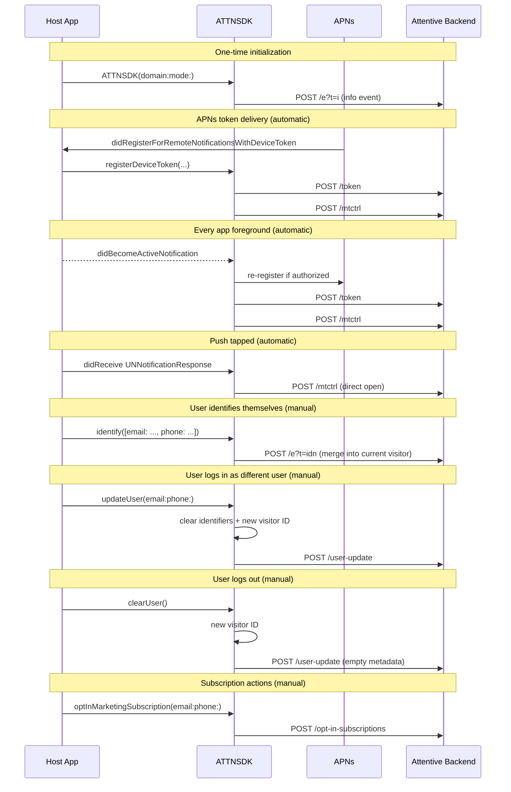

# Attentive iOS SDK — Identity calls

This document describes the identity-related SDK methods in the iOS SDK (`~/attentive-ios-sdk`), when they fire, what the backend does with them, and when an integrator needs to call them manually. It is a companion to [`identity.md`](./identity.md) (Android) and uses the same structure so the two can be compared directly.

## Overview

Every identity call reads from or writes to `ATTNUserIdentity`, an in-memory object holding:

- `visitorId` — auto-generated UUID (without hyphens), persisted in UserDefaults, regenerated on user switch or logout
- `clientUserId`, `email`, `phone`, `shopifyId`, `klaviyoId`, `customIdentifiers`

**Minimum integration** (events + auto push registration work):

1. `ATTNSDK(domain:mode:)` — required
2. APNs registered and `application(_:didRegisterForRemoteNotificationsWithDeviceToken:)` forwarding the token to `ATTNSDK.registerDeviceToken(...)` — required *only if* you want push notifications

Everything else (`identify`, `updateUser`, `optIn/Out`, `clearUser`) is optional and driven by the host app's user-account lifecycle.

## What fires automatically

| Trigger | Endpoint | What it does |
| --- | --- | --- |
| `ATTNSDK` init | `POST events.attentivemobile.com/e?t=i` | Ping ("info event") — not identity |
| App foreground (`UIApplication.didBecomeActiveNotification`) | `POST mobile.attentivemobile.com/token` + `POST /mtctrl` | Checks push authorization, re-registers token if authorized, fires an app-open event. Debounced to 2 seconds. |
| APNs token registration (`didRegisterForRemoteNotificationsWithDeviceToken`) | `POST /token` (+ `/mtctrl`) | Registers device token, permission status, and fires an app-open event |
| Push notification tapped | `POST /mtctrl` | Direct-open tracking |
| Permission state change (denied → authorized, detected on foreground) | `POST /token` | Clears cached token, re-registers with APNs, re-sends to `/token` |

Like Android, the foreground hook fires `/token` every time the app comes to the foreground — not just on process start. If APNs has not delivered a token yet, it is a no-op.

## Sequence diagram

## Methods

### `ATTNSDK.identify(_ userIdentifiers:)`

**Source:** `Sources/ATTNSDK/ATTNSDK.swift:143–149`

**Purpose:** Attach an email, phone, or other identifier to the current visitor.

**Fires immediately:** `POST events.attentivemobile.com/e?t=idn`

**Backend effect:** `UserIdentifierService.generateUserIdentity()` merges the submitted identifiers into the existing visitor profile. Merge, not replace — identifiers accumulate across calls.

**Changes visitor ID?** No.

**When to call:** whenever you learn the user's email, phone, or vendor IDs.

**Required?** No.

---

### `ATTNSDK.updateUser(email:phone:callback:)`

**Source:** `Sources/ATTNSDK/ATTNSDK.swift:559–587`

**Purpose:** Declare that the current device is now a different user.

**Fires:**

1. **Synchronously, locally:** clears all identifiers and generates a new visitor ID, then merges in the new email/phone.
2. **Async:** `POST /user-update` with the new visitor ID, current push token, and email/phone.

**Backend effect:** `UserUpdateController.handleUserUpdateRequest()` re-associates the push token with the new visitor.

**Changes visitor ID?** **Yes.**

**When to call:** user logs in as a different account on the same device.

**Required?** Only for multi-user apps.

---

### `ATTNSDK.clearUser()`

**Source:** `Sources/ATTNSDK/ATTNSDK.swift:190–209`

**Purpose:** Log the current user out. Resets local visitor identity and tells the backend to detach the push token from the prior user.

**Fires:**

1. **Synchronously, locally:** generates a new visitor ID.
2. **Async:** `POST /user-update` with empty metadata (only if a push token is present).

**Backend effect:** Detaches the push token from the previous user's identity and re-associates it with the new anonymous visitor.

**Changes visitor ID?** **Yes.**

**Required?** Strongly recommended on logout.

---

### `ATTNSDK.optInMarketingSubscription(email:phone:callback:)`

**Source:** `Sources/ATTNSDK/ATTNSDK.swift:439–475`

**Purpose:** Subscribe the user to Attentive marketing on email and/or SMS.

**Fires:** `POST mobile.attentivemobile.com/opt-in-subscriptions`

**Backend effect:** `NonPushSubscriptionController` creates a subscription record (`ACTION_TYPE_SUBSCRIBE`). Idempotent.

**Changes visitor ID?** No.

**iOS-specific behavior:** if no push token is available when called, the request is **queued for up to 60 seconds** and sent as soon as the token arrives (`ATTNSDK.swift:730–757`). This is different from Android, which fires the request immediately regardless of token state.

**Required?** Only if your app drives marketing opt-in UI.

---

### `ATTNSDK.optOutMarketingSubscription(email:phone:callback:)`

**Source:** `Sources/ATTNSDK/ATTNSDK.swift:493–529`

**Purpose:** Unsubscribe.

**Fires:** `POST /opt-out-subscriptions` — same queue-until-token behavior as opt-in.

---

### `ATTNSDK.registerDeviceToken(_:authorizationStatus:callback:)`

**Source:** `Sources/ATTNSDK/ATTNSDK.swift:267–298`

**Purpose:** Register the APNs device token and permission state with Attentive.

**Fires:** `POST /token`, then flushes any queued opt-in/out requests, then `POST /mtctrl`.

**When to call:** from `application(_:didRegisterForRemoteNotificationsWithDeviceToken:)` in your AppDelegate.

**Required?** Yes, if you want push notifications.

---

### (No direct `updatePushPermissionStatus` method)

Unlike Android, iOS does not expose a manual `updatePushPermissionStatus()` method. Permission re-registration happens automatically on app foreground (`handleAppDidBecomeActive` at `ATTNSDK.swift:639`), including the case where the user returns from Settings after changing permission (detected via authorization status flipping from denied → authorized, `ATTNSDK.swift:655–662`).

## Comparison: `identify()` vs `updateUser()`

|  | `identify()` | `updateUser()` |
| --- | --- | --- |
| Changes visitor ID | No — merges into current | Yes — generates new |
| Calls `/user-update` | No | Yes |
| Emits `/e?t=idn` | Yes | No (on iOS — Android also emits idn as a side effect, iOS does not) |
| Meaning | "Here is additional info about this visitor" | "This is a different person now" |

## Bonni iOS settings screen

Source: `Bonni/.../SettingsViewController.swift`

| UI Button | SDK method |
| --- | --- |
| "Add email" | `identify([email: ...])` |
| "Add phone" | `identify([phone: ...])` |
| "Switch User" | `updateUser(email:phone:)` |
| "Log Out" | `clearUser()` |
| "Clear User" | `clearUser()` (duplicate of "Log Out") |
| "Opt in email" | `optInMarketingSubscription(email:)` |
| "Opt out email" | `optOutMarketingSubscription(email:)` |
| "Opt in phone" | `optInMarketingSubscription(phone:)` |
| "Opt out phone" | `optOutMarketingSubscription(phone:)` |
| "Show Push Permission" | `registerForPushNotifications()` |

## iOS-specific behaviors (not on Android)

1. **Opt-in/out requests queue until a push token is available** (up to 60s). Android fires them immediately and relies on the backend accepting tokenless subscription requests. This is a precedent relevant to [MSDK-345](https://attentivemobile.atlassian.net/browse/MSDK-345) — iOS has already solved the tokenless-call problem by queueing rather than by backend change.
2. **Push-token sends debounced to 2 seconds** (`ATTNAPI.swift:62`). App-open events debounced to 2 seconds (`ATTNSDK.swift:354–360`). Android's `/mtctrl` is debounced to 3 seconds.
3. **Provisional push permission** — iOS automatically requests provisional notification permission on first foreground when permission is undetermined (`ATTNSDK.swift:717–728`). No equivalent on Android (no "provisional" concept in the OS).
4. **No manual `updatePushPermissionStatus()`** — permission re-registration is entirely automatic.
5. **No separate `AppLaunchTracker`** — app-launch tracking is handled inline by `handleRegularOpen()` which sends `/mtctrl` events with the app-launch type (`"ist": "al"`).

## Naming differences vs Android

| Android | iOS | Notes |
| --- | --- | --- |
| `AttentiveConfig.identify(userIdentifiers)` | `ATTNSDK.identify(_ userIdentifiers:)` | Same semantic, different parameter type (Map vs Dictionary). |
| `AttentiveSdk.updateUser(email, phoneNumber)` | `ATTNSDK.updateUser(email:phone:callback:)` | Same. iOS takes a callback; Android is fire-and-forget. |
| `AttentiveSdk.clearUser()` | `ATTNSDK.clearUser()` | Same name. iOS method is also imperfect without a token (same limitation). |
| `AttentiveSdk.optUserIntoMarketingSubscription(email, phone)` | `ATTNSDK.optInMarketingSubscription(email:phone:callback:)` | iOS name is ~30% shorter. The Android name reads as "opt *user* into marketing *subscription*" — iOS drops "user" and "subscription" cleanly. |
| `AttentiveSdk.optUserOutOfMarketingSubscription(...)` | `ATTNSDK.optOutMarketingSubscription(...)` | Same. |
| `AttentiveSdk.updatePushPermissionStatus(context)` | (none) | iOS handles it automatically. |

The iOS naming is generally tighter. The proposed Android renames in [`identity.md`](./identity.md#naming-proposal) would align Android closer to iOS in most cases, but would also introduce divergence in places (e.g. Android's proposed `subscribe`/`unsubscribe` vs iOS's `optInMarketingSubscription`/`optOutMarketingSubscription`). Any cross-platform rename should be coordinated.

## Known limitations / follow-ups

None currently tracked for iOS. The tokenless `/user-update` behavior flagged on Android as [MSDK-345](https://attentivemobile.atlassian.net/browse/MSDK-345) has the same underlying backend behavior on iOS, but iOS mitigates it through the opt-in/out queueing pattern (the queue holds requests until a token arrives, then flushes). If MSDK-345 results in a client-side fix, the same queueing approach could be extended to `/user-update` on iOS.
