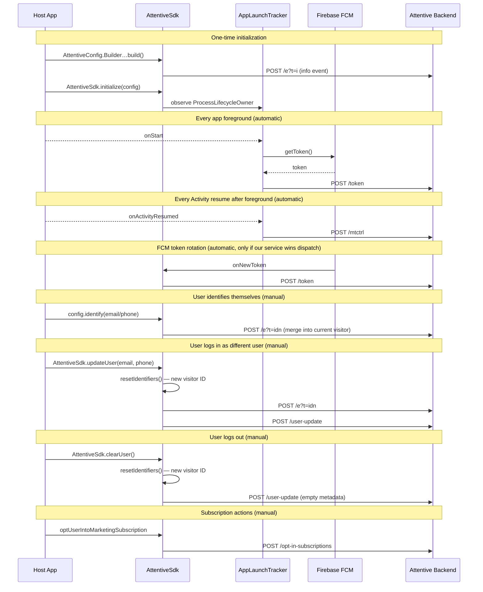

# Attentive Android SDK — Identity calls

This document describes the identity-related SDK methods, when they fire, what the backend does with them, and when an integrator needs to call them manually.

## Overview

Every identity call reads from or writes to `AttentiveConfig.userIdentifiers`, an in-memory object holding:

- `visitorId` — auto-generated UUID, persisted in SharedPreferences, regenerated on user switch or logout
- `clientUserId`, `email`, `phone`, `shopifyId`, `klaviyoId`, `customIdentifiers`

**Minimum integration** (events + auto push registration work):

1. `AttentiveConfig.Builder()…build()` — required
2. `AttentiveSdk.initialize(config)` — required
3. FCM set up in the host app — required *only if* you want push notifications

Everything else (`identify`, `updateUser`, `optIn/Out`, `clearUser`) is optional and driven by the host app's user-account lifecycle.

## What fires automatically

| Trigger | Endpoint | What it does |
| --- | --- | --- |
| `AttentiveConfig.Builder.build()` | `POST events.attentivemobile.com/e?t=i` | Ping ("info event") — not identity |
| App foreground (`ProcessLifecycleOwner.onStart`) | `POST mobile.attentivemobile.com/token` | Registers current FCM push token + permission state on the current visitor |
| Activity resume after foreground | `POST mobile.attentivemobile.com/mtctrl` | App-launch tracking (`APP_LAUNCHED` or `DIRECT_OPEN` if launched from push). Debounced to 3 seconds |
| FCM token rotation (`onNewToken`) | `POST /token` | Same as foreground-triggered `/token` call |

The foreground `/token` call happens every time the app comes to the foreground from background, not just on process start. If FCM has not yet delivered a token, this is a no-op.

## Sequence diagram

## Methods

### `AttentiveConfig.identify(userIdentifiers)`

**Purpose:** Attach an email, phone, or other identifier to the current visitor.

**Fires immediately:** `POST events.attentivemobile.com/e?t=idn`

**Backend effect:** `UserIdentifierService.generateUserIdentity()` merges the submitted identifiers into the existing visitor profile. This is a merge, not a replace — identifiers accumulate across calls.

**Changes visitor ID?** No.

**When to call:** whenever you learn the user's email, phone, or vendor IDs (sign-in, form submit, etc.). Safe to call multiple times.

**Required?** No. The SDK works without it — visitor-level events still land.

---

### `AttentiveSdk.updateUser(email, phoneNumber)`

**Purpose:** Declare that the current device is now a different user (multi-user apps).

**Fires:**

1. **Synchronously, locally:** `resetIdentifiers()` generates a new visitor ID and clears prior identifiers.
2. **Async:** `POST /user-update` with the new visitor ID, current push token, and email/phone.
3. **Async (triggered by step 2):** `POST /e?t=idn` with the new identifiers.

**Backend effect:** `UserUpdateController.handleUserUpdateRequest()` re-associates the push token with the new visitor. The `/e?t=idn` emission merges email/phone into the new visitor's profile.

**Changes visitor ID?** **Yes.**

**When to call:** user logs in as a different account on the same device.

**Required?** Only for apps that support multiple user accounts on one device.

> ⚠️ **Known limitation:** `/user-update` is silently dropped by the backend (204) if `pushToken` is blank. This affects apps without Firebase Cloud Messaging, and apps using `pushEnabled = false`. Under review — see [MSDK-345](https://attentivemobile.atlassian.net/browse/MSDK-345).

---

### `AttentiveSdk.clearUser()`

**Purpose:** Log the current user out. Resets local visitor identity and tells the backend to detach the push token from the prior user.

**Fires:**

1. **Synchronously, locally:** `resetIdentifiers()` generates a new visitor ID.
2. **Async:** `POST /user-update` with empty metadata and the new visitor ID.

**Backend effect:** Detaches the push token from the previous user's identity and re-associates it with the new anonymous visitor.

**Changes visitor ID?** **Yes.**

**When to call:** on logout.

**Required?** Strongly recommended on logout. Without it, the push token stays mapped to the logged-out user on the backend and will keep receiving targeted messages.

> ⚠️ **Known limitation:** Same as `updateUser()` — silent no-op on backend if `pushToken` is blank. See [MSDK-345](https://attentivemobile.atlassian.net/browse/MSDK-345).

> ⚠️ **Deprecated:** `AttentiveConfig.clearUser()` only clears local state and does NOT call `/user-update`. Always use `AttentiveSdk.clearUser()`. The deprecated method will be removed in a future release.

---

### `AttentiveSdk.optUserIntoMarketingSubscription(email, phoneNumber)`

**Purpose:** Subscribe the user to Attentive marketing on email and/or SMS.

**Fires:** `POST mobile.attentivemobile.com/opt-in-subscriptions`

**Backend effect:** `NonPushSubscriptionController` creates a subscription record (`ACTION_TYPE_SUBSCRIBE`). Idempotent.

**Changes visitor ID?** No.

**When to call:** user explicitly consents to marketing.

**Required?** Only if your app drives marketing opt-in UI. If subscriptions are managed entirely through Attentive's web/SMS flows, you never need to call this.

---

### `AttentiveSdk.optUserOutOfMarketingSubscription(email, phoneNumber)`

**Purpose:** Unsubscribe the user from Attentive marketing on email and/or SMS.

**Fires:** `POST /opt-out-subscriptions`

**Backend effect:** `ACTION_TYPE_UNSUBSCRIBE`. Idempotent.

**Changes visitor ID?** No.

**Required?** Only if your app drives subscription UI.

---

### `AttentiveSdk.updatePushPermissionStatus(context)`

**Purpose:** Re-register the push token with the latest `permissionGranted` state.

**Fires:** `POST /token` with current token and permission.

**When to call:** after the user returns from system settings and may have changed notification permission. Optional — the next app foreground will register permission state automatically.

**Required?** No.

## Comparison: `identify()` vs `updateUser()`

|  | `identify()` | `updateUser()` |
| --- | --- | --- |
| Changes visitor ID | No — merges into current | Yes — generates new |
| Calls `/user-update` | No | Yes |
| Emits `/e?t=idn` | Yes | Yes (via `/user-update` side-effect) |
| Meaning | "Here is additional info about this visitor" | "This is a different person now" |

## Known limitations / follow-ups

- **[MSDK-345](https://attentivemobile.atlassian.net/browse/MSDK-345)** — `/user-update` requires a non-blank FCM push token or it is silently discarded. Affects `updateUser()` and `clearUser()` for apps without Firebase or with `pushEnabled = false`. Under review.
- **Deprecated `AttentiveConfig.clearUser()`** — will be removed in a future release. Use `AttentiveSdk.clearUser()`.
